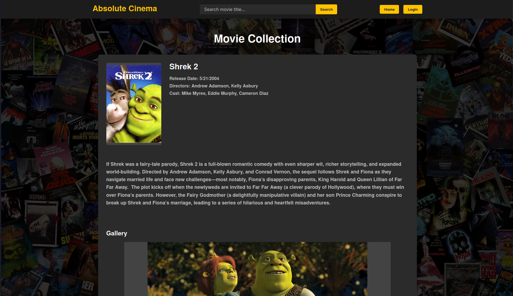
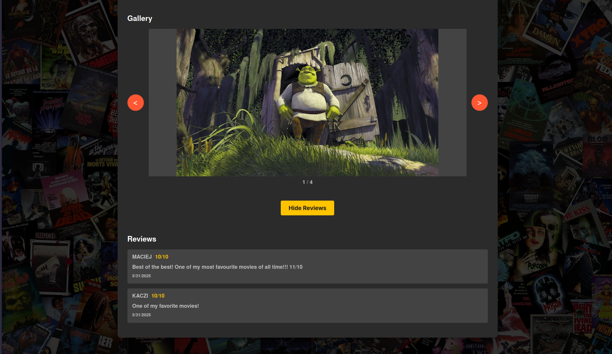
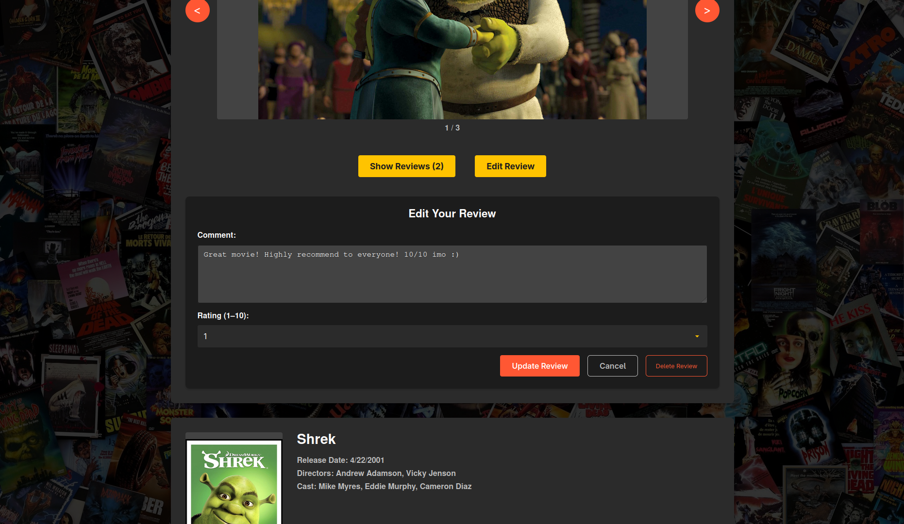
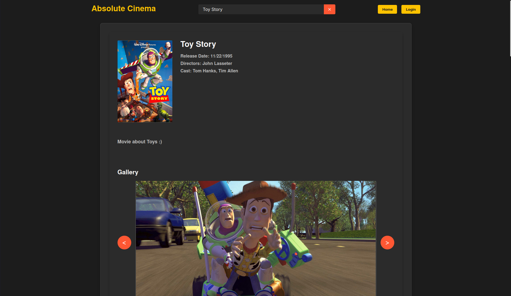
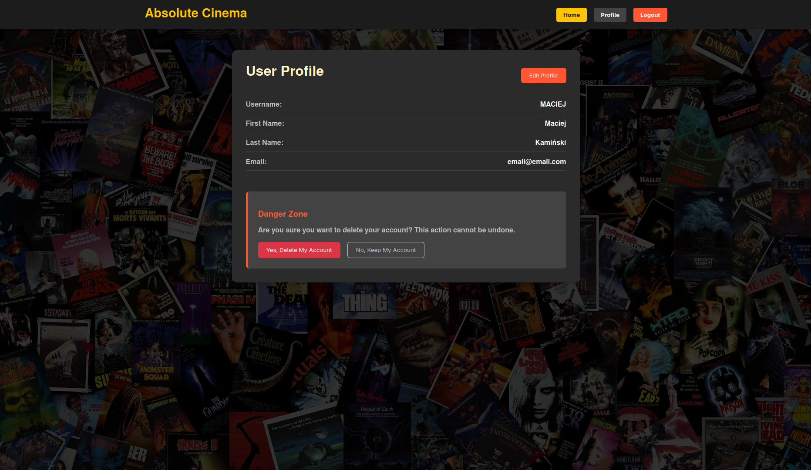
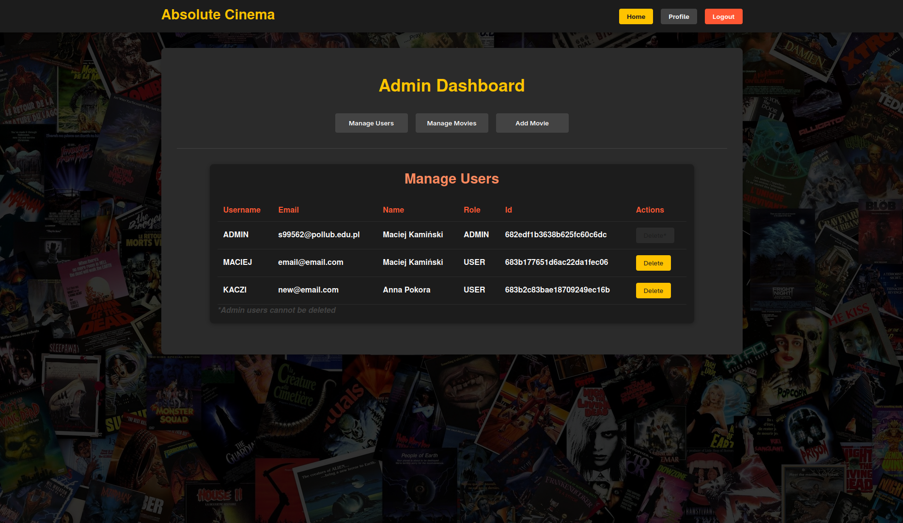
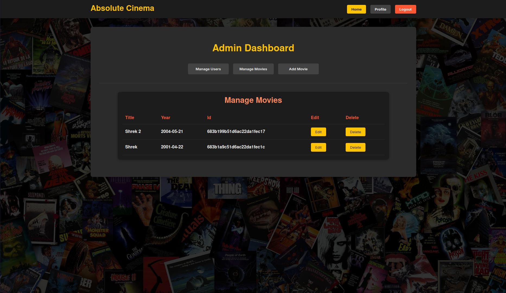
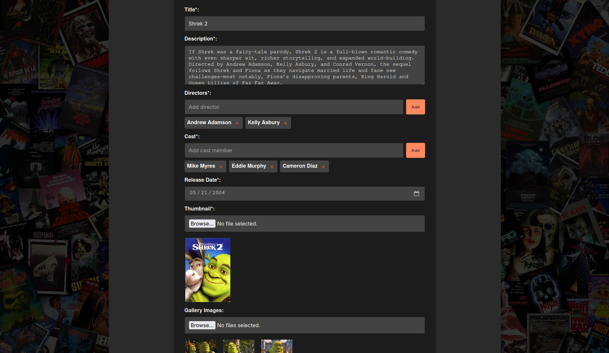

# 🎬 Absolute Cinema — *for movie lovers and haters*

## 📝 Overview

**Absolute Cinema** is a lightweight web application that allows users to browse movies and write reviews. It was developed as a final project for the course **Web Application Frameworks**.

Key features:
- 🔐 Role-based access control (ADMIN, USER, GUEST) implemented on both frontend and backend.
- 🛡️ Endpoint protection and UI content visibility adapted to the logged-in user's role.
- 🔑 JWT-based authentication and authorization.
- ⚛️ Frontend built with React components.
- ✅ Input validation on both client and server sides.

---

## 🛠️ Technologies Used

-  **React** – frontend  
-  **Node.js** – backend runtime  
-  **Express** – backend framework  
-  **MongoDB** – database  
-  **JWT** – authorization  
-  **CSS3** – styling

---

## 🚀 How to Run the Project

1. **Clone the repository:**
   ```bash
   git clone git@github.com:bamboo-tree/absolute-cinema.git
   cd absolute-cinema
   ```

2. **Start MongoDB:**
   - **Linux:**
     ```bash
     sudo systemctl start mongodb
     ```
   - **Windows:**
     Use a local MongoDB client (e.g., MongoDB Compass or run via installed MongoDB service).

3. **Start the backend server:**
   ```bash
   cd server
   npm install
   node server.js
   ```

4. **Start the frontend client:**
   ```bash
   cd ../client
   npm install
   npm start
   ```

5. **Open the app in your browser:**
   ```
   http://localhost:3000/home
   ```

> ℹ️ Example `.env` files are included in the repository for testing and educational purposes only. In a production environment, these should be kept private and excluded from version control.

---

## 👤 User Roles and Functionalities

| Functionality                              | GUEST 👤 | USER 🧑 | ADMIN 🛠️ |
|-------------------------------------------|:--------:|:------:|:--------:|
| Browse movies and reviews                  |   ✅     |   ✅   |    ❌    |
| Search for movies by title                |   ✅     |   ✅   |    ❌    |
| Register an account                       |   ✅     |   ❌   |    ❌    |
| Submit, edit, and delete own reviews      |   ❌     |   ✅   |    ❌    |
| Manage profile (update info, change pwd)  |   ❌     |   ✅   |    ❌    |
| Access admin dashboard                    |   ❌     |   ❌   |    ✅    |
| Manage users (view/delete)                |   ❌     |   ❌   |    ✅    |
| Manage movies (edit/delete)               |   ❌     |   ❌   |    ✅    |
| Add new movies                            |   ❌     |   ❌   |    ✅    |

---

## 📸 Screenshots

 
_Home page - GUEST_

_Reviews - GUEST_

_Edit review - USER_

_Search movie - GUEST_

_Profile - USER_
 
_Manage users - ADMIN_

_Manage movies - ADMIN_

_Add movie - ADMIN_

_Edit movie - ADMIN_

---

## ⚠️ Known Issues

- 🔁 Server does not currently auto-restart on file changes – consider using `nodemon` in development.
- ❌ No rate-limiting implemented – could be vulnerable to spam or brute-force login attempts.
- 🧪 Unit and integration testing is not implemented.

---

## 💡 Lessons Learned

Working on Absolute Cinema allowed me to:
- Deepen my understanding of full-stack application architecture.
- Learn how to implement secure role-based authorization using JWT tokens.
- Handle real-world issues like CORS policies, asynchronous data validation, and frontend-backend coordination.
- Improve React component structuring and reuse.
- Understand the importance of separating business logic between layers of the application.

If I were to approach this project again, I would:
- Add better error handling and toast notifications for UX.
- Introduce pagination and sorting for improved performance and usability.
- Use Redux or another state management library to simplify data flow.
- Write automated tests for critical functionalities.

---

## 📁 Project Structure

```
absolute-cinema/
├── client/          # React frontend
├── server/          # Node.js/Express backend
├── screenshots/     # UI screenshots
└── README.md
```

